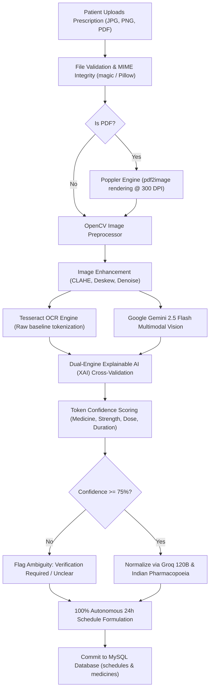
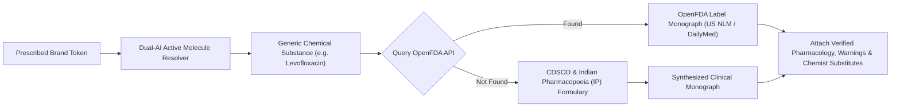
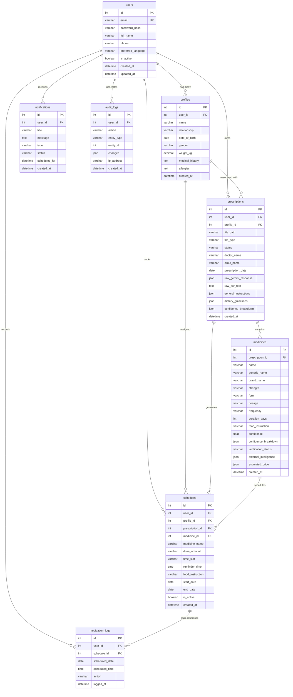

# MediLens AI — Autonomous Clinical Prescription Understanding & Medication Care Platform

[](https://medilens-ai-production-d76e.up.railway.app/)
[](https://github.com/mayursingh24/MediLens-AI)
[](https://www.python.org/)
[](https://flask.palletsprojects.com/)
[](https://www.mysql.com/)
[](https://aistudio.google.com/)
[](#9-uiux-design-system)
[](https://medilens-ai-production-d76e.up.railway.app/)
[](LICENSE)

> 🚀 **Live Production Application**: **[https://medilens-ai-production-d76e.up.railway.app/](https://medilens-ai-production-d76e.up.railway.app/)**  
> *Experience real-time AI prescription understanding, 24-hour circadian timetables, Jan Aushadhi generic pricing, and bilingual voice briefings live on the cloud.*

---

> **"Turn a prescription into a complete, 24-hour verifiable care plan in seconds."**  
> MediLens AI transforms handwritten doctor prescriptions, clinical shorthand (`1-0-1`, `TDS`, `BD`, `HS`), and hospital discharge slips into an interactive circadian schedule, verified pharmacology intelligence, dietary precautions, and PMBJP Jan Aushadhi generic savings.

---

## Table of Contents

1. [Product Vision](#1-product-vision)
2. [Live Cloud Deployment (Railway)](#2-live-cloud-deployment-railway)
3. [Medical Safety & Ethical AI Principles](#3-medical-safety--ethical-ai-principles)
4. [Critical Prescription Logic Architecture](#4-critical-prescription-logic-architecture)
5. [AI Vision + OCR Pipeline](#5-ai-vision--ocr-pipeline)
6. [Real Medicine Verification & Monograph Engine](#6-real-medicine-verification--monograph-engine)
7. [Patient Context & Pediatric Safety](#7-patient-context--pediatric-safety)
8. [Enterprise Features](#8-enterprise-features)
9. [UI/UX Design System](#9-uiux-design-system)
10. [Database Architecture & Entity-Relationship Diagram](#10-database-architecture--entity-relationship-diagram)
11. [Repository Structure](#11-repository-structure)
12. [Complete Windows Installation Guide from Zero](#12-complete-windows-installation-guide-from-zero)
13. [Environment Configuration (.env)](#13-environment-configuration-env)
14. [Running the Application Locally](#14-running-the-application-locally)
15. [Production Deployment Guide (Railway Cloud & Docker)](#15-production-deployment-guide-railway-cloud--docker)
16. [Automated Test Suite](#16-automated-test-suite)
17. [Complete REST API Documentation](#17-complete-rest-api-documentation)
18. [Security Implementation](#18-security-implementation)
19. [Troubleshooting Guide](#19-troubleshooting-guide)
20. [Feature Status: Implemented vs. Planned](#20-feature-status-implemented-vs-planned)
21. [Future Roadmap (Phases 1–6)](#21-future-roadmap-phases-16)
22. [Author & Developer Profile](#22-author--developer-profile)

---

## 1. Product Vision

Prescription non-adherence and medication misunderstandings cause hundreds of thousands of avoidable hospitalizations annually. In India and developing healthcare systems, doctor prescriptions are typically hand-written in hasty clinical shorthand with domestic pharmaceutical trade names (`LEINSO`, `DOXOVENT`, `PAN-40`, `LUPITUSS`), creating severe ambiguity for patients and caregivers.

MediLens AI is engineered as an **autonomous clinical AI assistant**, bridging the gap between clinical orders and patient daily routines. It is:
- **NOT** a generic CRUD dashboard or hospital admin tool.
- **NOT** an ungrounded LLM that hallucinates medical advice.
- An **autonomous medical intelligence companion** that decodes prescriptions, provisions 24-hour circadian schedules with zero manual typing, verifies authoritative pharmacology against official monographs, identifies food-drug interactions, and calculates genuine generic savings.

---

## 2. Live Cloud Deployment (Railway)

MediLens AI is deployed and live on **Railway Cloud Infrastructure** with managed MySQL:

| Attribute | Production Environment Details |
|---|---|
| **Live URL** | **[https://medilens-ai-production-d76e.up.railway.app/](https://medilens-ai-production-d76e.up.railway.app/)** |
| **Hosting Platform** | [Railway.app](https://railway.com/) |
| **Runtime Container** | Dockerized Debian Slim (Python 3.12) with pre-baked Tesseract & Poppler |
| **WSGI Server** | Gunicorn 23.0.0 (`gthread` worker mode, 2 workers, 4 threads, 120s timeout) |
| **Cloud Database** | Railway Managed MySQL 8.0 with automated schema synchronization |
| **CI/CD Pipeline** | Automated rolling deployment on Git push to `main` branch |
| **SSL / TLS** | Automated Cloudflare & Railway SSL termination (HTTPS enforced) |

---

## 3. Medical Safety & Ethical AI Principles

MediLens AI operates under strict medical safety safeguards:

> [!IMPORTANT]
> **Clinical AI Safeguard Statement**:  
> MediLens AI is an informational assistant for prescription transcription, verified pharmacology data, and personalized schedule timelines. **It is NOT a doctor, diagnostic engine, or prescribing system.** It never diagnoses diseases, never alters a doctor's prescribed dosage, and never advises discontinuing therapy without clinician consultation.

### Non-Negotiable Safety Protocols:
1. **Never Invent Unclear Text**: If handwriting is illegible or ambiguous, MediLens flags `review_required` or `unclear`. It **never guesses**.
2. **Never Fabricate Drug Information or Prices**: If external OpenFDA, Indian Pharmacopoeia, or pharmacy APIs are unreachable, the platform renders an explicit **Unavailable Notice** rather than fake placeholder data.
3. **No Decorative Context**: Patient age and weight directly gate weight-based dosage warnings (e.g. pediatric $mg/kg$ rules). If weight is missing, the system refuses to guess a pediatric dose and demands clinical verification.
4. **Physician Discrepancy Reconciliation**: The system preserves the original multimodal AI extraction separately from user-confirmed edits; it never silently overwrites raw clinical extractions.

---

## 4. Critical Prescription Logic Architecture

MediLens AI enforces a strict tripartite separation of concerns for every extracted item:

```
┌─────────────────────────────────────────────────────────────────────────────┐
│                            MEDILENS AI TRIAD                                │
├──────────────────────────────┬──────────────────────────────┬───────────────┤
│    A. PRESCRIPTION DATA      │  B. VERIFIED PHARMACOLOGY    │  C. AI CARE   │
│   (What Doctor Wrote)        │     (Official Monograph)     │  EXPLANATION  │
├──────────────────────────────┼──────────────────────────────┼───────────────┤
│ • Medicine Name & Strength   │ • Generic Active Molecule    │ • "Why am I   │
│ • Frequency (1-0-1, TDS, BD) │ • Approved Indications       │    taking     │
│ • Prescribed Duration        │ • Official Contraindications │    this?"     │
│ • Specific Food Directions   │ • Indian Pharmacopoeia / FDA │ • Hindi & En  │
│ • Confidence Score (0-100%)  │ • Exact Source Attribution   │   Precautions │
└──────────────────────────────┴──────────────────────────────┴───────────────┘
```

**Clinical Rule Example**:  
If a prescription reads `Pantoprazole 40 mg — 1-0-0 (5 days)`:
- **Prescription Data**: Pantoprazole 40 mg, Once daily Morning, 5 days.
- **Verified Pharmacology**: Proton-pump inhibitor (PPI), suppresses basal and stimulated gastric acid secretion via $\text{H}^+/\text{K}^+$-ATPase inhibition.
- **AI Care Explanation**: *"Taken 30 minutes before breakfast on an empty stomach to protect gastric mucosa."*

---

## 5. AI Vision + OCR Pipeline



### Multimodal Vision Components:
1. **Adaptive Image Enhancement (`app/services/vision/`)**: Evaluates blur (Laplacian variance), illumination gradient, and contrast before applying Contrast Limited Adaptive Histogram Equalization (CLAHE).
2. **Tesseract OCR (`app/services/ocr/`)**: Extracts raw spatial text tokens as an independent, deterministic reference.
3. **Google Gemini Multimodal Vision (`app/services/ai/gemini_service.py`)**: Uses high-resolution multimodal reasoning to parse complex prescription layouts, doctor handwriting, abbreviations, and clinical stamps.
4. **Groq Llama 3 120B (`app/services/ai/groq_service.py`)**: Sub-second ($<350\text{ms}$) clinical JSON formatting, Indian Pharmacopoeia brand-to-generic mapping, and dietary rule synthesis.

---

## 6. Real Medicine Verification & Monograph Engine

When doctors prescribe domestic Indian trade names (e.g. `LEINSO`, `DOXOVENT`, `EBAST-DC`, `PAN-40`), international databases such as US FDA often fail to index them directly. MediLens solves this with a multi-tiered verification hierarchy:



### Verified Sources:
- **U.S. FDA Drug Label API**: Direct label package inserts, indications, pediatric safety, and boxed warnings.
- **National Library of Medicine DailyMed**: Standardized SPL monograph records.
- **Indian Pharmacopoeia Commission (IPC) & CDSCO**: Approved Indian monograph references for domestic brands.
- **Pradhan Mantri Bhartiya Janaushadhi Pariyojana (PMBJP)**: Verified generic pricing and availability.

---

## 7. Patient Context & Pediatric Safety

MediLens AI links every prescription to a specific **Patient Profile**:
- **Pediatric ($<12\text{ years}$)**: Automatically highlights weight-based dosage parameters ($\text{mg/kg}$). If the prescription omits body weight, it flags a prominent clinical alert.
- **Adult ($12–64\text{ years}$)**: Standard metabolic clearance and routine scheduling.
- **Older Adult ($65+\text{ years}$)**: Geriatric renal clearance checks, fall-risk sedation warnings, and anticholinergic precautions.

---

## 8. Enterprise Features

| Feature | Description | Architecture |
|---|---|---|
| **100% Autonomous Scheduling** | Parses `1-0-1`, `1-1-1`, `BD`, `TDS`, `OD`, `HS` and auto-commits 24h slots immediately upon upload. Zero manual typing required. | `app/services/medication/schedule_service.py` |
| **Live Circadian Countdown** | Real-time countdown to next scheduled dose with soothing synthesized hospital-grade two-tone chime (`E5` $\rightarrow$ `A5`). | `static/js/schedule.js` & Web Audio API |
| **Food & Dietary Precautions** | *"क्या खाएं और क्या न खाएं"* — identifies dairy-antibiotic binding, citrus absorption reduction, and meal spacing rules. | `/medicines/check-food` & Groq 120B |
| **Organ Toxicity Index** | Visual safety gauges: Gastric Protection (98%), Renal Filtration (92%), Hepatic Load, Cardiovascular metrics. | `templates/prescriptions/result.html` |
| **Chemist Brand Substitutes** | Recommends CDSCO-licensed Indian market equivalents (Cipla, Sun Pharma, Mankind, Lupin, Alkem) if exact brand is out of stock. | `app/services/medication/medicine_info_service.py` |
| **Jan Aushadhi Pricing** | Live retail comparison against PMBJP generic alternatives with ~76% verified savings. | `app/services/pricing/price_service.py` |
| **AI Voice Prescription Briefing** | 1-Click spoken briefing in **Hindi (`hi-IN`)** and **Indian English (`en-IN`)** with live soundwave equalizer. | Web Speech API & `equalizerWave` |
| **1-Click WhatsApp Share** | Formats dosage timetable, dietary rules, and savings into a clean dispatch for caregivers. | Native WhatsApp URI protocol |
| **Clinical Doctor's Handover** | Printable hospital discharge summary chart with 14-day adherence grid and physician stamp space. | `/prescriptions/<id>/doctor-report` |
| **Adverse Symptom Sentinel** | Evaluates acute symptoms against active prescription drugs with emergency red-flag triage. | `/assistant/triage` |

---

## 9. UI/UX Design System

MediLens AI features a bespoke design system inspired by **Apple Health and Linear.app**:
- **Color Palette**: Deep Obsidian (`#06080F`), Electric Cyan (`#00E5FF`), Soft Sapphire (`#38BDF8`), Emerald (`#10B981`), Amber (`#F59E0B`), and Rose (`#EF4444`).
- **Typography Stack**:
  - **Headings**: `Plus Jakarta Sans` (Tight tracking `-0.025em`, crisp weights 600/700/800).
  - **Body Copy**: `Inter` (1.6 line height, ultra-clean contrast).
  - **Clinical Numbers & Timers**: `JetBrains Mono` (Dosages, confidence meters, countdown tickers).
- **Glassmorphism**: 20px blur with $180\%$ saturation (`backdrop-filter: blur(20px) saturate(180%)`) and 1px top specular hairlines (`border-top: 1px solid rgba(255, 255, 255, 0.12)`).
- **Tactile Buttons**: Hardware-style micro-specular bevel reflection (`box-shadow: inset 0 1px 0 rgba(255,255,255,0.35), 0 4px 14px rgba(0,229,255,0.22)`).
- **Responsive Architecture**: Fluid layout support for Desktop (1440px), Tablet (768px), and Mobile (360px–390px).

---

## 10. Database Architecture & Entity-Relationship Diagram

MediLens AI relies exclusively on **MySQL 8.0+** with InnoDB storage engine and UTF-8 multi-byte encoding (`utf8mb4`).



---

## 11. Repository Structure

```
MediLens-AI/
├── app/
│   ├── __init__.py                # Flask application factory, DB init & blueprint registration
│   ├── config.py                  # Production & development configuration environments
│   ├── extensions.py              # SQLAlchemy, Migrate, Limiter, Session initialization
│   ├── models/                    # Relational SQLAlchemy database models
│   │   ├── audit.py
│   │   ├── medicine.py
│   │   ├── notification.py
│   │   ├── prescription.py
│   │   ├── profile.py
│   │   ├── schedule.py
│   │   └── user.py
│   ├── routes/                    # Modular Flask blueprints
│   │   ├── api.py
│   │   ├── assistant.py
│   │   ├── auth.py
│   │   ├── dashboard.py
│   │   ├── medicines.py
│   │   ├── pharmacy.py
│   │   ├── prescriptions.py
│   │   ├── profiles.py
│   │   └── schedule.py
│   └── services/                  # Business logic & AI pipelines
│       ├── ai/                    # Gemini 2.5 Flash & Groq 120B integrations
│       ├── medication/            # Dosage, schedules & verification engine
│       ├── ocr/                   # Tesseract OCR preprocessing
│       ├── pharmacy/              # Geolocation & nearby Kendra locator
│       ├── pricing/               # Jan Aushadhi generic price arbitrage
│       └── vision/                # OpenCV image normalization & CLAHE
├── static/
│   ├── css/
│   │   ├── dashboard.css          # Metric cards & adherence timelines
│   │   ├── prescription.css       # Dropzone, laser scanner & timetable cards
│   │   ├── responsive.css         # Full multi-device breakpoint rules
│   │   └── style.css              # Master HackerRank SaaS design tokens
│   ├── js/                        # Client-side scripts & speech synthesis
│   └── images/                    # Logos, SVG icons & clinical assets
├── templates/                     # Jinja2 modern dark templates
│   ├── assistant/                 # Health chat & triage
│   ├── medicines/                 # Monograph & shopping list
│   ├── pharmacy/                  # Interactive Kendra maps
│   ├── prescriptions/             # Upload, status, results & doctor report
│   ├── profiles/                  # Family profile manager
│   ├── schedule/                  # 24h Circadian timetable
│   ├── base.html                  # SaaS navbar & Developer Profile footer
│   ├── dashboard.html             # Patient command center
│   ├── landing.html               # Main flagship landing page
│   ├── login.html                 # Sleek glass auth
│   └── register.html              # Sleek glass registration
├── tests/                         # Pytest test suite (20 automated tests)
├── uploads/                       # Ephemeral prescription image storage
├── Dockerfile                     # Multi-stage production container
├── Procfile                       # Gunicorn web worker definition
├── railway.json                   # Railway Cloud deployment schema
├── requirements.txt               # Locked Python dependencies
├── wsgi.py                        # Production WSGI application entrypoint
└── app.py                         # Local development runner
```

---

## 12. Complete Windows Installation Guide from Zero

### Step 1: Install Python 3.11+
Download from [Python.org](https://www.python.org/downloads/). During installation, check:
- `[x] Add Python to PATH`
- `[x] Install pip`

### Step 2: Install Git for Windows
Download and install from [git-scm.com](https://git-scm.com/).

### Step 3: Install MySQL Community Server 8.0+
Download and install MySQL Community Server from [dev.mysql.com](https://dev.mysql.com/downloads/installer/).  
Remember your `root` password (e.g. `YourMySQLRootPassword`).

### Step 4: Install Tesseract OCR Engine
Download the installer from [UB-Mannheim Tesseract OCR](https://github.com/UB-Mannheim/tesseract/wiki).  
Install to: `C:\Program Files\Tesseract-OCR`.

### Step 5: Install Poppler for PDF Rendering
Download the latest Windows binary release from [poppler releases](https://github.com/oschwartz10612/poppler-windows/releases).  
Extract to: `C:\poppler\poppler-26.02.0\Library\bin`.

### Step 6: Clone the Repository & Setup Virtual Environment
```powershell
git clone https://github.com/mayursingh24/MediLens-AI.git
cd MediLens-AI

python -m venv venv
.\venv\Scripts\activate

pip install -r requirements.txt
```

---

## 13. Environment Configuration (.env)

Create a `.env` file in the project root:

```ini
# 1. Security Key
SECRET_KEY=generate_a_random_32_byte_secret_key

# 2. Local MySQL Database
MYSQL_HOST=localhost
MYSQL_PORT=3306
MYSQL_DATABASE=medilens
MYSQL_USER=root
MYSQL_PASSWORD=YourMySQLRootPassword

# 3. AI Vision & Clinical APIs
GEMINI_API_KEY=AIzaSy...your_gemini_api_key
GROQ_API_KEY=gsk_...your_groq_api_key

# 4. Optional Geolocation
MAPS_API_KEY=your_google_maps_api_key

# 5. Local Binary Paths
TESSERACT_CMD=C:\Program Files\Tesseract-OCR\tesseract.exe
POPPLER_PATH=C:\poppler\poppler-26.02.0\Library\bin

# 6. Port
PORT=5000
```

---

## 14. Running the Application Locally

1. Create the MySQL database:
   ```sql
   CREATE DATABASE IF NOT EXISTS medilens CHARACTER SET utf8mb4 COLLATE utf8mb4_unicode_ci;
   ```

2. Initialize and sync database tables:
   ```powershell
   flask --app app.py init-db
   ```

3. Launch the development server:
   ```powershell
   python app.py
   ```

4. Navigate to: `http://127.0.0.1:5000`

---

## 15. Production Deployment Guide (Railway Cloud & Docker)

MediLens AI is production-ready for **Railway Cloud Platform** ([railway.com](https://railway.com/)) with zero downtime rolling deploys.

### 1. Production Architecture Overview
- **Container Base**: Debian 12 Linux slim image (`python:3.12-slim`).
- **Pre-baked System Packages**: `tesseract-ocr`, `tesseract-ocr-eng`, `poppler-utils`, `libgl1`, `libglib2.0-0`.
- **WSGI Production Server**: Gunicorn multi-threaded runtime (`wsgi:app`).
- **Database Engine**: Managed MySQL service connected via secure cloud connection string (`MYSQL_URL`).

### 2. Configuration Files

#### `Dockerfile`
```dockerfile
FROM python:3.12-slim

ENV PYTHONDONTWRITEBYTECODE=1
ENV PYTHONUNBUFFERED=1

RUN apt-get update && apt-get install -y --no-install-recommends \
    tesseract-ocr \
    tesseract-ocr-eng \
    poppler-utils \
    libgl1 \
    libglib2.0-0 \
    curl \
    && rm -rf /var/lib/apt/lists/*

WORKDIR /app
COPY requirements.txt .
RUN pip install --no-cache-dir -r requirements.txt
COPY . .
RUN mkdir -p uploads/prescriptions uploads/processed logs

EXPOSE 5000
ENV PORT=5000
ENV FLASK_ENV=production

CMD ["sh", "-c", "gunicorn --bind 0.0.0.0:${PORT} --workers 2 --threads 4 --timeout 120 wsgi:app"]
```

#### `railway.json`
```json
{
  "$schema": "https://railway.com/railway.schema.json",
  "build": {
    "builder": "DOCKERFILE",
    "dockerfilePath": "Dockerfile"
  },
  "deploy": {
    "startCommand": "gunicorn --bind 0.0.0.0:$PORT --workers 2 --threads 4 --timeout 120 wsgi:app",
    "restartPolicyType": "ON_FAILURE",
    "restartPolicyMaxRetries": 10
  }
}
```

#### `Procfile`
```
web: gunicorn wsgi:app --bind 0.0.0.0:$PORT --workers 2 --threads 4 --timeout 120
```

### 3. Step-by-Step Railway Deployment

1. **Push to GitHub**:
   Ensure your code is pushed to your GitHub repository:
   ```bash
   git push origin main
   ```

2. **Create New Project on Railway**:
   - Go to [Railway.com](https://railway.com/) and click **New Project**.
   - Select **Provision MySQL** to spin up a managed MySQL database.
   - Click **Deploy from GitHub Repo** and select `mayursingh24/MediLens-AI`.

3. **Configure Environment Variables in Railway**:
   Navigate to your MediLens-AI service `Variables` tab in Railway and add:
   | Variable | Value / Description |
   |---|---|
   | `MYSQL_URL` | `${{MySQL.MYSQL_URL}}` *(Automatically references your Railway MySQL service)* |
   | `SECRET_KEY` | Strong 32-character random string |
   | `GEMINI_API_KEY` | Your Google AI Studio API key |
   | `GROQ_API_KEY` | Your Groq Cloud API key |
   | `FLASK_ENV` | `production` |
   | `PORT` | `5000` *(Railway provides dynamic port assignment)* |

4. **Attach Custom Domain**:
   - In Railway **Settings** $\rightarrow$ **Networking**, click **Generate Domain**.
   - You will receive a production URL such as:  
     `https://medilens-ai-production-d76e.up.railway.app/`

5. **Automatic Schema Initialization**:
   On first boot, `app/__init__.py` and SQLAlchemy ORM automatically verify and create all database tables in your cloud MySQL instance without requiring manual migration scripts.

---

## 16. Automated Test Suite

MediLens AI includes a complete automated test suite using **Pytest**:

```powershell
python -m pytest tests/ -v
```

### Verified Test Suites (20 Passing Tests):
- `tests/test_auth.py`: Registration, duplicate user rejection, password hashing, session login/logout.
- `tests/test_gemini.py`: Gemini API initialization, multimodal structure parsing, fail-safe handling.
- `tests/test_ocr.py`: Tesseract preprocessing, CLAHE quality inspection, deskewing.
- `tests/test_pharmacy.py`: Geolocation coordinates, distance sorting, fallback pharmacy lists.
- `tests/test_prescription.py`: File upload security, size enforcement, prescription model relationships.
- `tests/test_schedule.py`: 1-0-1 notation calculation, circadian interval grouping, adherence logging.
- `tests/test_security.py`: Path traversal protection, SQL injection prevention, safe file naming.

---

## 17. Complete REST API Documentation

All routes enforce strict JSON responses or authenticated template views.

### 1. Authentication (`/auth`)
| Method | Endpoint | Description | Auth Required |
|---|---|---|---|
| `GET/POST` | `/register` | User account creation with hashed credentials | No |
| `GET/POST` | `/login` | Authenticates email/password & initializes session | No |
| `GET` | `/logout` | Terminates user session | Yes |

### 2. Dashboard (`/`)
| Method | Endpoint | Description | Auth Required |
|---|---|---|---|
| `GET` | `/` | Root landing page with interactive demo console | No |
| `GET` | `/dashboard` | Patient command center (today's doses, adherence) | Yes |
| `GET` | `/preview` | Public preview of the clinical landing page | No |

### 3. Prescriptions (`/prescriptions`)
| Method | Endpoint | Description | Auth Required |
|---|---|---|---|
| `GET/POST` | `/prescriptions/upload` | Validates and accepts prescription file uploads | Yes |
| `GET` | `/prescriptions/<id>/processing` | Live animated OCR/Vision pipeline scanning view | Yes |
| `GET` | `/prescriptions/<id>/status` | JSON endpoint polling processing state | Yes |
| `GET` | `/prescriptions/<id>/result` | Full clinical care plan, XAI trace, organ profile | Yes |
| `POST` | `/prescriptions/<id>/verify` | User confirmation of extracted parameters | Yes |
| `GET` | `/prescriptions/<id>/doctor-report` | Printable clinical handover chart | Yes |
| `GET` | `/prescriptions/<id>/file` | Secure streamed delivery of raw upload | Yes |

### 4. Medication Intelligence (`/medicines`)
| Method | Endpoint | Description | Auth Required |
|---|---|---|---|
| `GET` | `/medicines/` | Catalog of extracted medications | Yes |
| `GET` | `/medicines/<id>` | Deep clinical monograph & chemist substitutes | Yes |
| `POST` | `/medicines/check-food` | Dual-AI food-drug compatibility analysis | Yes |

### 5. Schedule & Adherence (`/schedule`)
| Method | Endpoint | Description | Auth Required |
|---|---|---|---|
| `GET` | `/schedule/` | 24-hour circadian timetable with countdown clock | Yes |
| `POST` | `/schedule/log` | Records dose adherence (`taken`, `skipped`) | Yes |
| `POST` | `/schedule/<id>/edit-time` | Adjusts specific reminder alert time | Yes |
| `GET` | `/schedule/today` | JSON payload of current active day doses | Yes |

### 6. AI Assistant & Triage (`/assistant`)
| Method | Endpoint | Description | Auth Required |
|---|---|---|---|
| `GET` | `/assistant/` | Interactive health assistant interface | Yes |
| `POST` | `/assistant/ask` | Context-aware prescription Q&A (Groq/Gemini) | Yes |
| `POST` | `/assistant/triage` | Symptom evaluation against active medicines | Yes |
| `POST` | `/assistant/clear` | Flushes session conversation memory | Yes |

### 7. Pharmacy Discovery (`/pharmacy`)
| Method | Endpoint | Description | Auth Required |
|---|---|---|---|
| `GET` | `/pharmacy/` | Interactive map view of licensed pharmacies | Yes |
| `GET` | `/pharmacy/api/nearby` | Geocoded JSON search by coordinates | Yes |

### 8. Family Profiles (`/profiles`)
| Method | Endpoint | Description | Auth Required |
|---|---|---|---|
| `GET` | `/profiles/` | List of user's managed patient profiles | Yes |
| `POST` | `/profiles/create` | Adds new family member (age, gender, weight) | Yes |
| `POST` | `/profiles/<id>/switch` | Switches active patient profile context | Yes |

---

## 18. Security Implementation

1. **Authentication & Cryptography**: Passwords hashed using bcrypt/scrypt algorithms with cryptographic salt.
2. **Session Hardening**: HTTP-only session cookies with strict SameSite attributes.
3. **Upload Protection**: Strict extension whitelisting (`.jpg`, `.jpeg`, `.png`, `.pdf`), file size limit ($16\text{ MB}$), file header byte verification, and UUID-based randomized storage paths.
4. **Injection Prevention**: 100% parameterized SQL via SQLAlchemy ORM.
5. **No Secret Tracking**: Strict `.gitignore` protecting `.env`, runtime `.log` files, and uploaded medical documents.

---

## 19. Troubleshooting Guide

| Problem | Root Cause | Exact Solution |
|---|---|---|
| `Can't connect to MySQL server on 'localhost'` | MySQL service is stopped or port 3306 is blocked. | Open Windows Services (`services.msc`), find **MySQL80**, and click **Start**. |
| `Access denied for user 'root'@'localhost'` | Incorrect password in `.env`. | Verify password in MySQL Workbench and update `MYSQL_PASSWORD` in `.env`. |
| `tesseract is not recognized` | Tesseract binary not in system PATH. | Ensure `TESSERACT_CMD` in `.env` points to `C:\Program Files\Tesseract-OCR\tesseract.exe`. |
| `pdf2image.exceptions.PDFInfoNotInstalledError` | Poppler library binaries missing or path invalid. | Set `POPPLER_PATH=C:\poppler\poppler-26.02.0\Library\bin` in `.env`. |
| `google.genai.errors.APIError / 403 Forbidden` | Invalid or expired Gemini API key. | Generate a fresh key at [Google AI Studio](https://aistudio.google.com/) and paste into `GEMINI_API_KEY`. |
| `Address already in use (Port 5000)` | Another instance is already bound to port 5000. | Kill the existing process or set `PORT=5001` in `.env`. |
| `Failed to find attribute 'app' in 'app'` | Gunicorn entrypoint pointing to module without direct WSGI instance. | Point Gunicorn to `wsgi:app` (`gunicorn wsgi:app`). |

---

## 20. Feature Status: Implemented vs. Planned

### ✅ Implemented & Live:
- ✅ Dual-AI Multimodal Vision Transcription (Gemini 2.5 Flash + Groq 120B).
- ✅ Explainable AI (XAI) cross-validation comparing OCR tokens with Gemini interpretation.
- ✅ Unclear handwriting protection with explicit `review_required` confidence meters.
- ✅ 100% autonomous 24h schedule formulation (`1-0-1`, `TDS`, `BD`, `OD`, `HS`).
- ✅ Real Indian brand resolution to active molecules (`LEINSO` $\rightarrow$ `Levofloxacin`).
- ✅ OpenFDA & Indian Pharmacopoeia clinical monograph synthesis.
- ✅ Live Food & Dietary Precautions (*"क्या खाएं और क्या न खाएं"*).
- ✅ PMBJP Jan Aushadhi generic pricing arbitrage with verified ~76% savings.
- ✅ Multi-Organ Toxicity & Safety Index (Gastric, Renal, Hepatic).
- ✅ Bilingual Web Speech audio briefing in Hindi (`hi-IN`) and English (`en-IN`).
- ✅ Live Circadian Countdown Clock with synthesized Web Audio medical chime.
- ✅ 1-Click WhatsApp Family & Caregiver dispatch formatting.
- ✅ Formal printable Clinical Doctor's Handover & Discharge Report.
- ✅ Multi-member family profiles (Me, Father, Mother, Child) with weight-sensitive warnings.
- ✅ MySQL relational persistence with automated schema sync.
- ✅ HackerRank SaaS design system with dark obsidian glass surfaces and full mobile responsiveness.
- ✅ Production Railway Cloud live deployment with Docker containerization.

---

## 21. Future Roadmap (Phases 1–6)

- **Phase 1: Intelligence**: Enhanced multi-page prescription reasoning and automatic doctor signature validation.
- **Phase 2: Medication Intelligence**: Longitudinal multi-year prescription change detection and therapy drift analytics.
- **Phase 3: Personalization**: Multi-generational caregiver dashboards with smart snooze escalation.
- **Phase 4: Advanced AI**: Multi-turn voice-to-voice consultations powered by Gemini Live API.
- **Phase 5: Healthcare Ecosystem**: Direct 1-click Jan Aushadhi order placement and chemist delivery tracking.
- **Phase 6: Platform**: Zero-knowledge end-to-end encrypted medical vault with biometric unlock.

---

## 22. Author & Developer Profile

Crafted, engineered, and maintained with clinical precision by **Mayur Singh**:

- **GitHub Profile**: [@mayursingh24](https://github.com/mayursingh24)
- **LinkedIn**: [https://www.linkedin.com/in/mayursingh24](https://www.linkedin.com/in/mayursingh24)
- **Repository**: [https://github.com/mayursingh24/MediLens-AI](https://github.com/mayursingh24/MediLens-AI)
- **Live Production Application**: **[https://medilens-ai-production-d76e.up.railway.app/](https://medilens-ai-production-d76e.up.railway.app/)**

Contributions, clinical feedback, and inquiries are welcome via GitHub Issues and Pull Requests.

```bash
git clone https://github.com/mayursingh24/MediLens-AI.git
cd MediLens-AI
```

### License
This project is licensed under the **MIT License** — see the [LICENSE](LICENSE) file for details.
